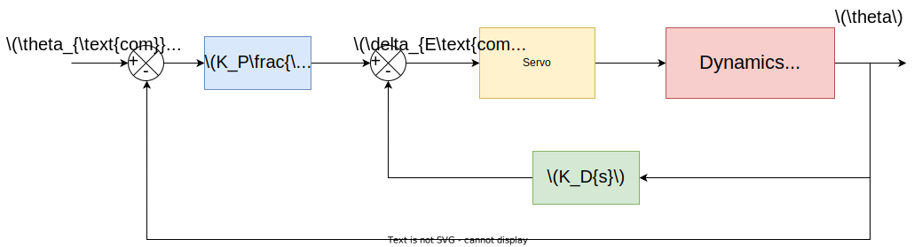
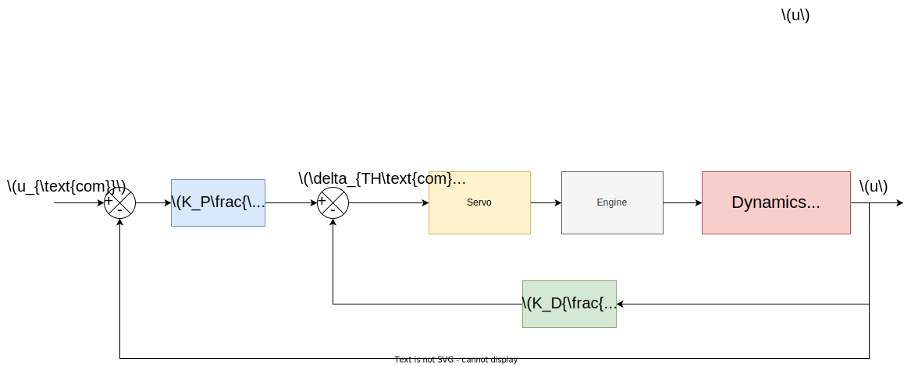
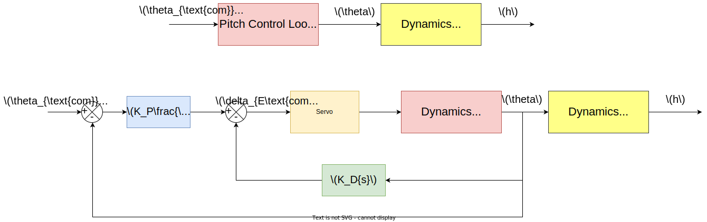
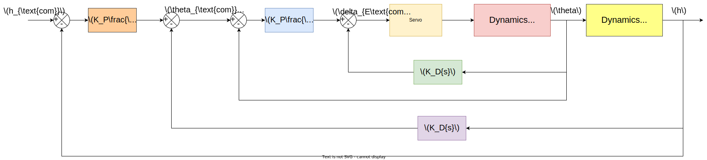
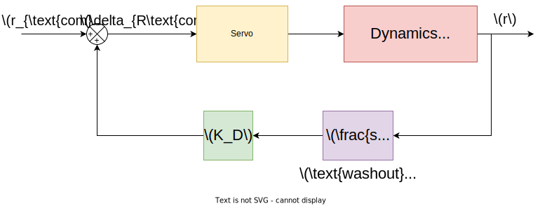
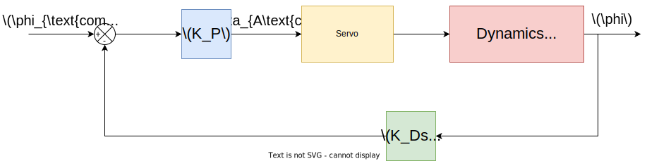

# Controllers

Controlling this system uses multiple control loop, each loop has one input and one output.

# Pitch Controller

For pitch controlling, Here is the system block diagram.

Here we have input is **Elevator** and output is **Pitch Angle**. Adding controller to this system.

Here is gain values

| Aircraft  | Flight Condition |     Gain Name     | Gain Value |
| :-------: | :--------------: | :---------------: | :--------: |
| Boeing747 |        2         |       $K_P$       |   1.631    |
|           |                  | $\frac{K_I}{K_P}$ |   0.6421   |
|           |                  |       $K_D$       |   1.4495   |

# Velocity Controller

Here is system block diagram.

Here, we have input is **Thrust** and output is velocity.

Here is gain values

| Aircraft  | Flight Condition |     Gain Name     | Gain Value |
| :-------: | :--------------: | :---------------: | :--------: |
| Boeing747 |        2         |       $K_P$       |   129.86   |
|           |                  | $\frac{K_I}{K_P}$ |  0.08971   |
|           |                  |       $K_D$       |   23265    |
|           |                  |     $K_{ZD}$      |    0.1     |
|           |                  |     $K_{PD}$      |   1.831    |

# Altitude Controller

Here is block diagrams

Here, we have input is **Pitch Angle** and output is **Altitude**.

Here is gain values

| Aircraft  | Flight Condition |     Gain Name     | Gain Value |
| :-------: | :--------------: | :---------------: | :--------: |
| Boeing747 |        2         |       $K_P$       | 0.00082979 |
|           |                  | $\frac{K_I}{K_P}$ |   0.1388   |
|           |                  |       $K_D$       | 0.0013795  |

# Yaw Damper Controller

Here is block diagrams

Here, we have input is **roll rate** and output is **roll**.

Here is gain values

| Aircraft  | Flight Condition | Gain Name | Gain Value |
| :-------: | :--------------: | :-------: | :--------: |
| Boeing747 |        2         |   $K_D$   |   2.0089   |
|           |                  |   $K_W$   |  0.09856   |

**Note**: washout here acts as high pass filter. which passes only high frequencies, this makes control over oscillations only. 

# Roll Controller

Here is block diagrams

Here, we have input is **Aliron Angle** required and output is **roll angle**.

Here is gain values

| Aircraft  | Flight Condition | Gain Name | Gain Value |
| :-------: | :--------------: | :-------: | :--------: |
| Boeing747 |        2         |   $K_D$   |   0.5255   |
|           |                  |   $K_P$   |  4.0438   |