# Linearization

Linearize aircraft equations[$^{[1]}$](#references) and get transfer function for 12 states with 4 inputs. System is divided into both longitudinal and lateral equations.

# Results

Compare non-linear equations results with linearized equations to see difference.

|    Input     |                    Graphs                    |
| :----------: | :------------------------------------------: |
| $\delta{E}$  |  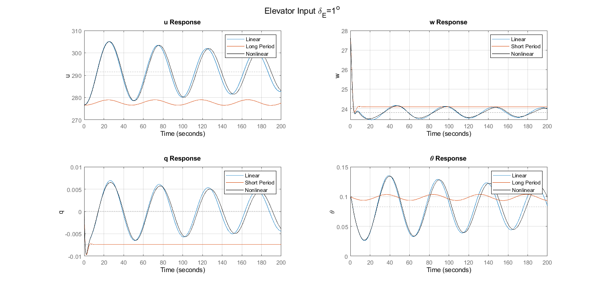   |
|              |  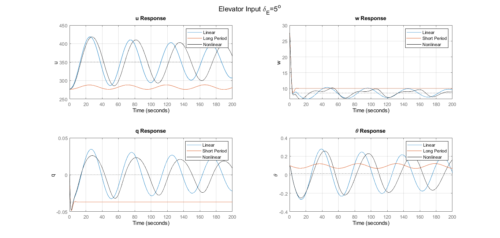   |
|              | 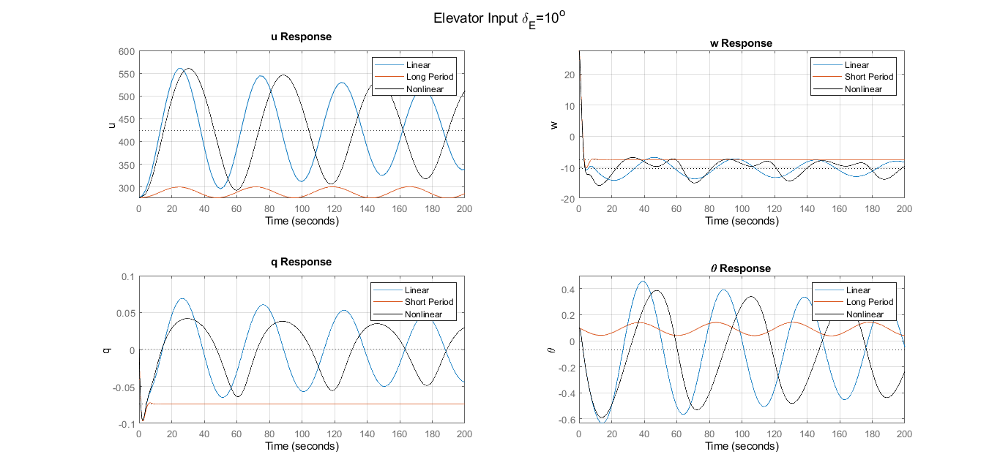  |
|              | 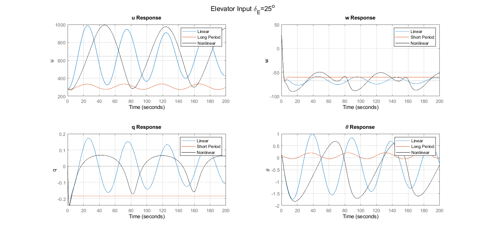  |
| $\delta{TH}$ |  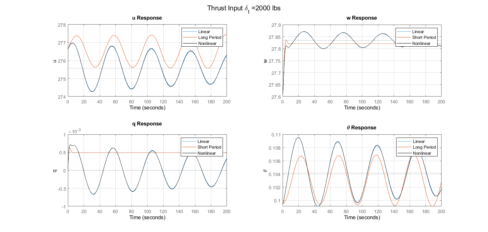  |
|              |  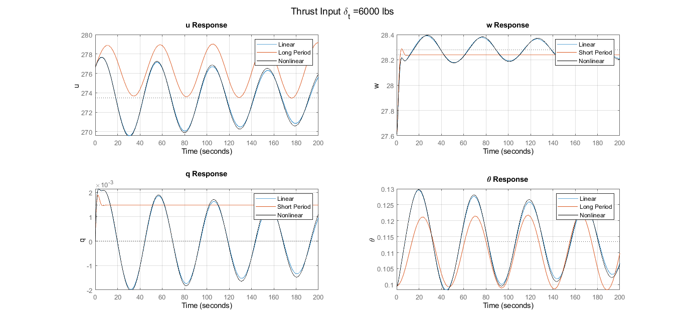  |
|              | 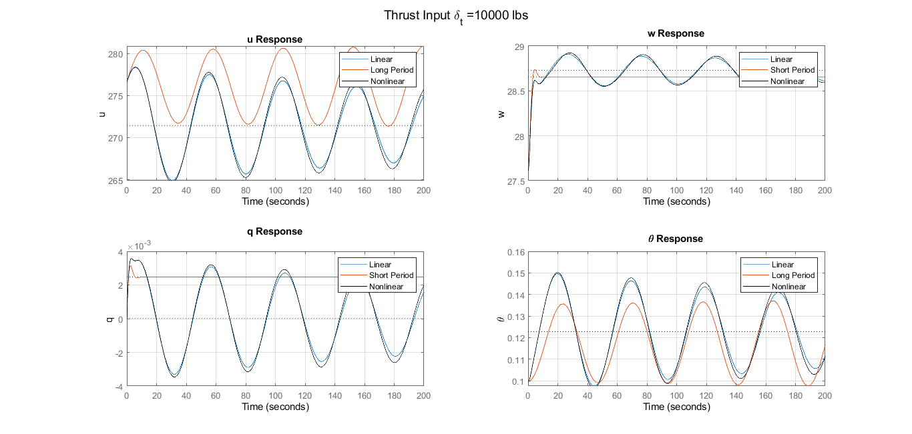 |
| $\delta{A}$  |  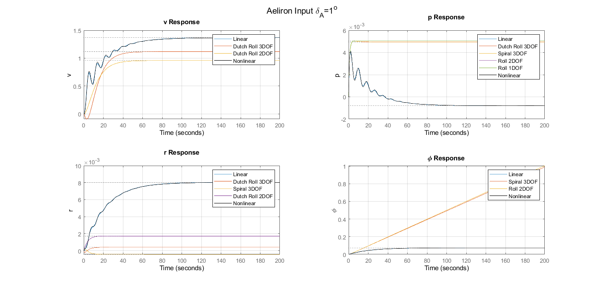   |
|              |  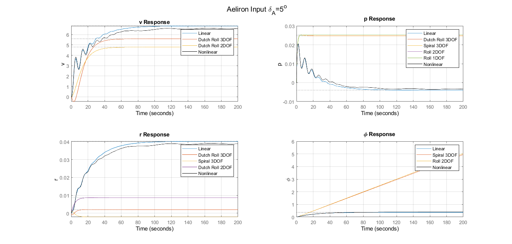   |
|              | 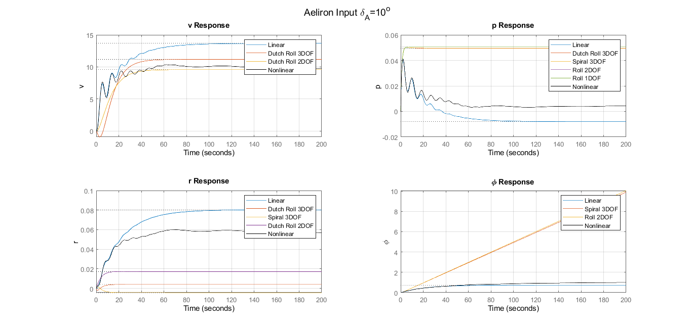  |
|              | 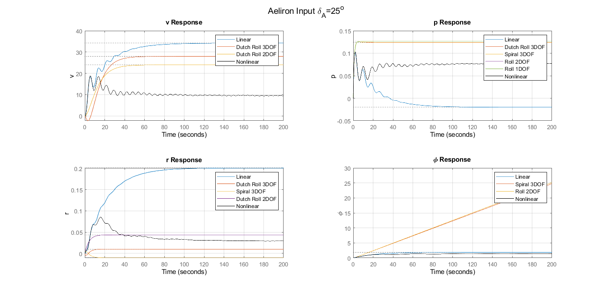  |
| $\delta{R}$  |  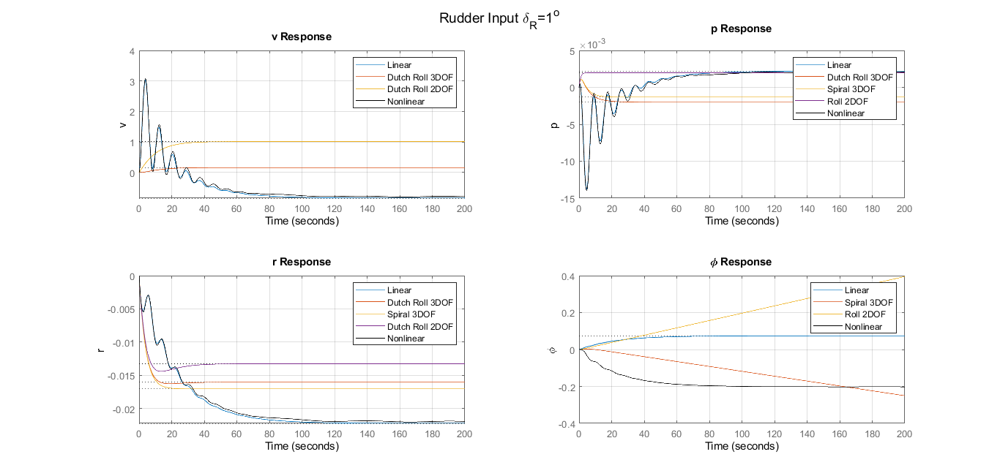   |
|              |  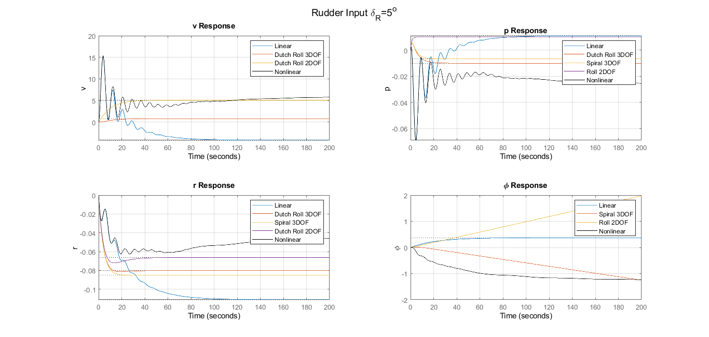   |
|              | 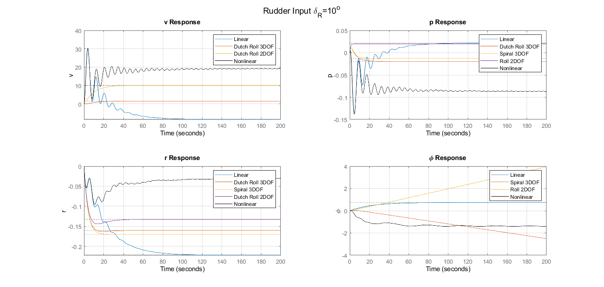  |
|              | 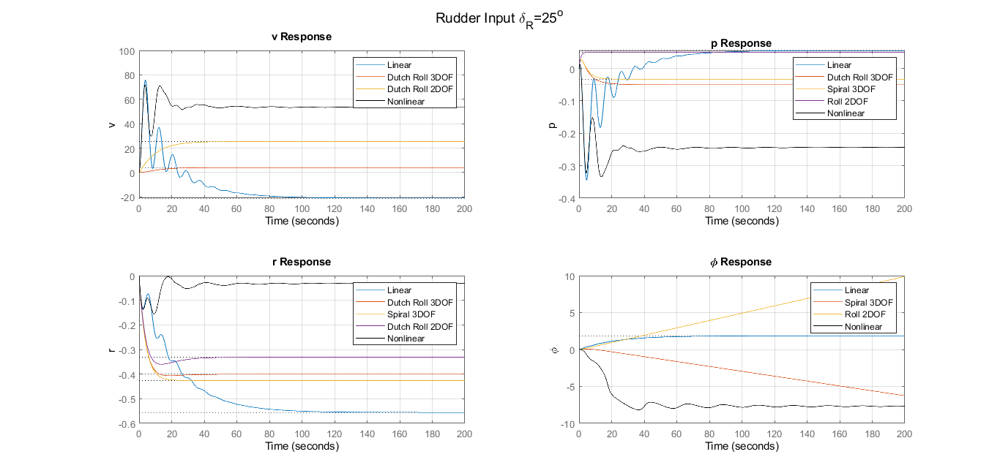  |

# References

[1] Nelson, R. C. (1998). Flight stability and automatic control. WCB/McGraw Hill. 