# Non-Linear Simulator

Adding aircraft aerodynamics equations[$^{[1]}$](#references) to RBD equations and solve it to get fully non-linear simulator.

# Results

Comparing results for simulator with given benchmark test data. For Boeing 747 at flight condition 5 from [$[2]$](#references)

|                   Trajectory                   |                   States                   |
| :--------------------------------------------: | :----------------------------------------: |
| 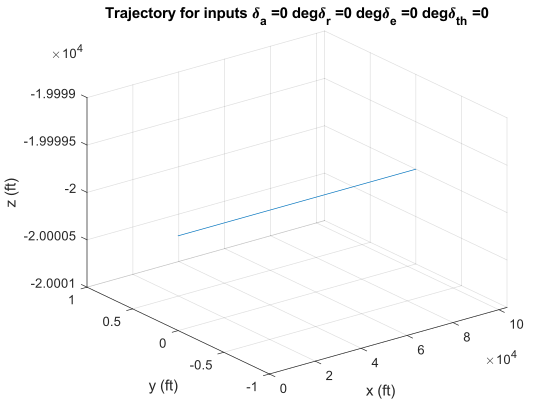 | 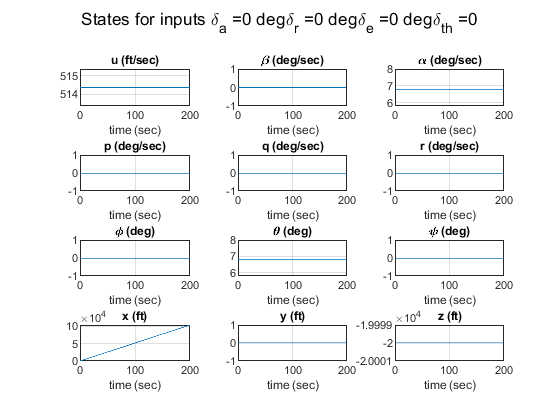 |
| 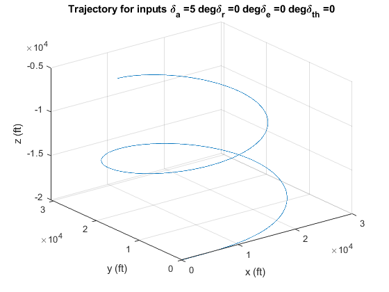 | 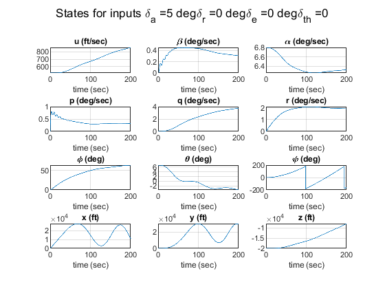 |
| 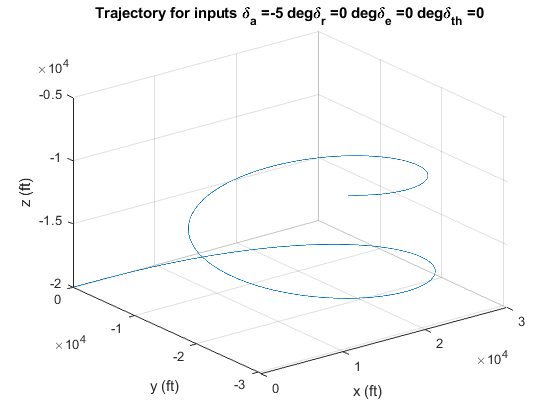 | 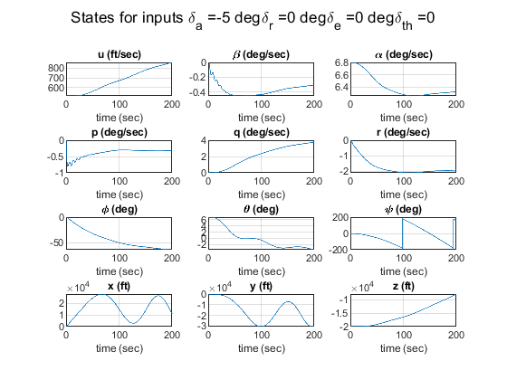 |
| 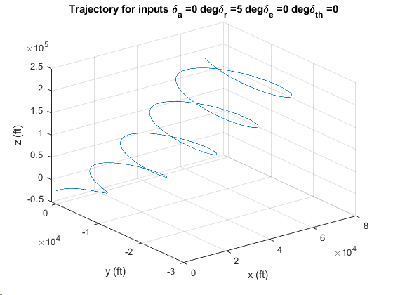 | 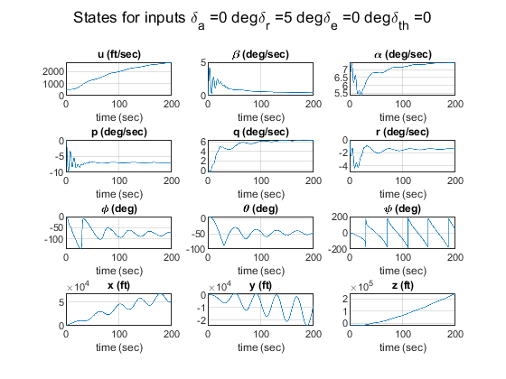 |
| 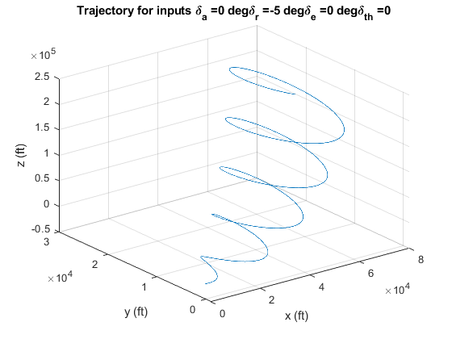 | 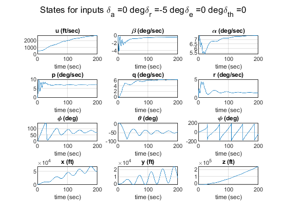 |
| 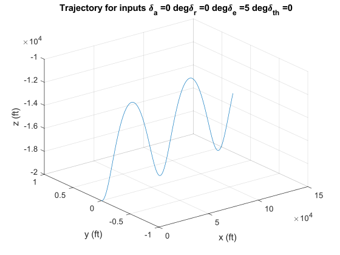 | 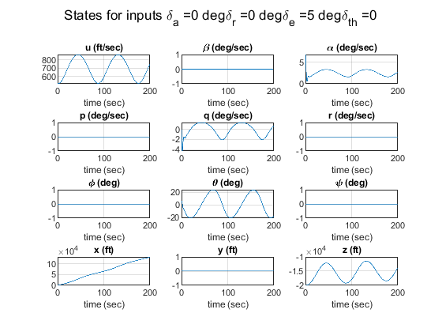 |
| 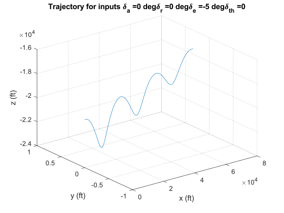 | 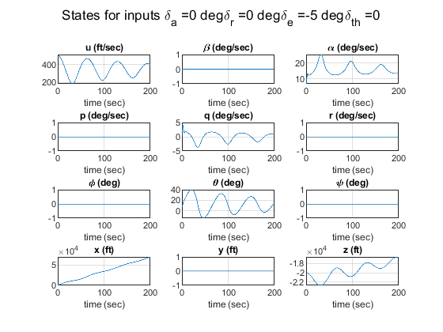 |
| 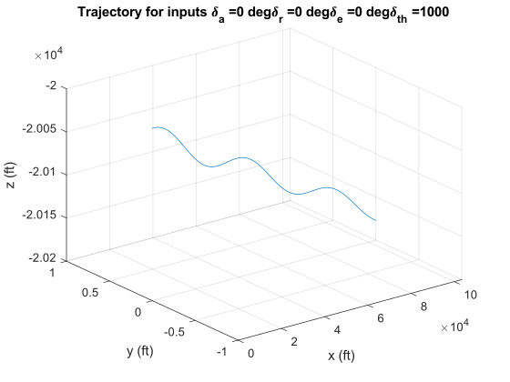 | 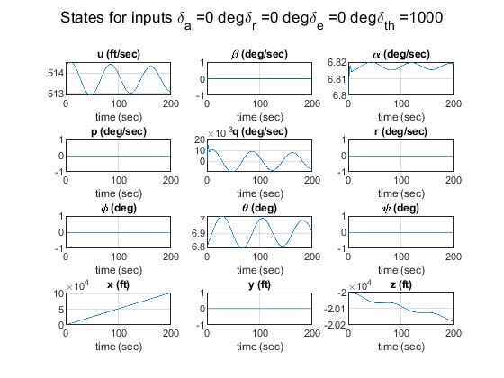 |
|  | 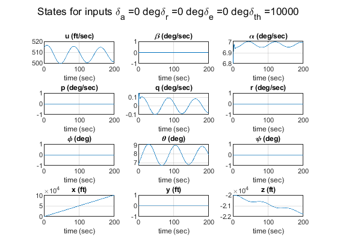 |

# References

[1] Nelson, R. C. (1998). Flight stability and automatic control. WCB/McGraw Hill. 

[2] Heffley, R. K., & Jewell, W. F. (1972). Aircraft handling qualities data (No. AD-A277031). NASA.