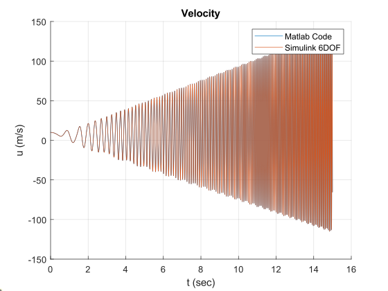

# RBD Solution

Solving Rigid Body Dynamics (RBD) equations[$^{[1]}$](#refernces) to get 12 states of body at anytime.

# System States

$$
\begin{align*}
&\begin{rcases}
\space \space 1. & u \\ 
\space \space 2. & v \\ 
\space \space 3. & w
\end{rcases} 
\text{Velocities in } X_B, Y_B \text{ and }  Z_B \\
&\begin{rcases} 
\space \space 4. & p \\ 
\space \space 5. & q \\ 
\space \space 6. & r
\end{rcases}
\text{Angular velocity around } X_B, Y_B \text{ and } Z_B \\ 
&\begin{rcases}
\space \space 7. & \phi \\ 
\space \space 8. & \theta \\ 
\space \space 9. & \psi
\end{rcases}
\text{Euler angles} \\ 
&\begin{rcases}
10. & x \\ 
11. & y \\ 
12. & z
\end{rcases}
\text{Position in } X, Y \text{ and } Z
\end{align*}
$$

# Example

Solving system equations and compare it with results from Simulink 6DOF block for Validation. Given:

$$
\text{Forces} = \begin{bmatrix}10 \\ 5 \\ 9\end{bmatrix} \text{N}
$$

$$
\text{Moments} = \begin{bmatrix}10 \\ 20 \\ 5\end{bmatrix} \text{N.m}
$$

$$
\text{mass} = 15 \text{kg}
$$

$$
I = \begin{bmatrix} 
    1  & -2 & -1 \\
    -2 &  5 & -3 \\
    -1 & -3 & 0.1
 \end{bmatrix}
$$

$$
T_\text{final} = 15 \text{ sec}
$$

Initial Conditions:

$$
\begin{align*}
& u_0      = 10                \\ 
& v_0      = 2                 \\ 
& w_0      = 0                 \\
& p_0      = 2\frac{\pi}{180}  \\ 
& q_0      = \frac{\pi}{180}   \\ 
& r_0      = 0                 \\
& \phi_0   = 20\frac{\pi}{180} \\ 
& \theta_0 = 15\frac{\pi}{180} \\ 
& \psi_0   = 30\frac{\pi}{180} \\
& x_0      = 2                 \\ 
& y_0      = 4                 \\ 
& z_0      = 7                 
\end{align*}
$$

# Results

|                  x                  |                  y                  |                  z                  |
| :---------------------------------: | :---------------------------------: | :---------------------------------: |
|  |  |  |
|  |  |  |
|  |  |  |
|  |  |  |

Results are almost the same, but graphs does not show it accurately, so calculating root mean square error and mean absolute error for each state using both data from matlab code and simulink.

|  State   | RMSE $\left(\times 10^{-8}\right)$ | MAE$\left(\times 10^{-10}\right)$ |
| :------: | ---------------------------------- | --------------------------------- |
|    u     | 0.032339514101834                  | 0.128052053526161                 |
|    v     | 0.029013801318108                  | 0.131111920467027                 |
|    w     | 0.049296451185103                  | 0.104899755851815                 |
|    p     | 0.000003405510848                  | 0.005447975099031                 |
|    q     | 0.000009237759856                  | 0.001923243586620                 |
|    r     | 0.000022017707794                  | 0.003692451892232                 |
|  $\phi$  | 0.002754806426977                  | 0.003229283961250                 |
| $\theta$ | 0.001224791937417                  | 0.002221596682087                 |
|  $\psi$  | 0.000875052399399                  | 0.002746981648728                 |
|    x     | 0.262327176569591                  | 0.262314885341566                 |
|    y     | 0.446840241039183                  | 0.447874052391318                 |
|    z     | 0.135148441779349                  | 0.135344666625455                 |

Results are very small (almost zero), matlab code is too close to simulink values.

# Refernces

[1] Nelson, R. C. (1998). Flight stability and automatic control. WCB/McGraw Hill. 