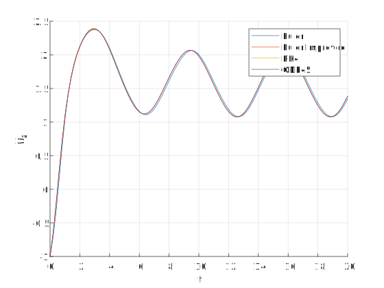
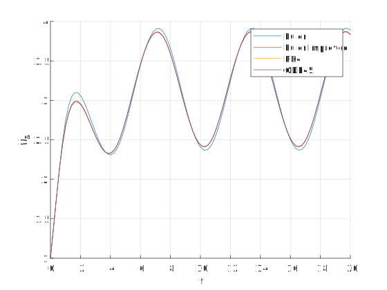

# ODE Numerical Solution

Simulator equations are ODE (ordinary differential euations) and solved using numerical methods. It provides multiple methods for solution:

1. Euler
2. Euler Improved
3. Runge Kutta 4th order

# Example

Here is simple example to validate functions with results from matlab **ode45** function. Required functions are:

$$
Y(t, y_1, y_2) = \begin{bmatrix}y_1(t, y_1, y_2) \\ y_2(t, y_1, y_2)\end{bmatrix}
$$

ode

$$
\frac{dy_1}{dt} = \sin(t) + \cos(y_1) + \sin(y_2) 
$$

$$
\frac{dy_2}{dt} = \cos(t) + \sin(y_2) 
$$

where

$$
t = 0 \Rightarrow 20
$$

$$
Y_0 = \begin{bmatrix}y_1 \\ y_2\end{bmatrix} = \begin{bmatrix}-1 \\ 1\end{bmatrix}
$$

using number of points to be 100 point.

# Results

Methods are to close in solution.